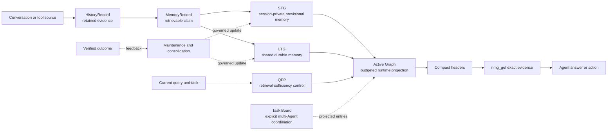

# NMG concept map

[中文](concept-map.zh-CN.md)

This page is a learning and navigation aid, not a second specification. It gives
each major concept one operational meaning and links to the document that owns
the full contract. When this map and an owner disagree, the owner wins.

## The system in one picture



The shortest useful reading is: NMG preserves evidence, organizes claims in STG
and LTG, and exposes only a query-scoped Active Graph. Search returns a compact
directory; `get` opens selected exact evidence.

## Core concepts

| Concept | Operational meaning | Why it exists | Contract owner |
| --- | --- | --- | --- |
| `HistoryRecord` | Retained source evidence and provenance | A semantic summary must remain checkable | [design.md §4](../design/design.md#4-core-data-model) |
| `MemoryRecord` | One retrievable, scoped claim derived from evidence | Retrieval needs a smaller unit than a transcript | [design.md §4](../design/design.md#4-core-data-model) |
| `MemoryNode` | A stable semantic address grouping related records | Records need local organization without losing their IDs | [design.md §4](../design/design.md#4-core-data-model) |
| STG | Session-private graph for provisional or current-task meaning | New information must be useful before long-term structure is trusted | [memory-graphs.md §3](../design/memory-graphs.md#3-short-term-graph-stg) |
| LTG | Shared persistent graph for durable memory and consolidated structure | Long-running Agents need reusable state beyond one session | [memory-graphs.md §4](../design/memory-graphs.md#4-long-term-graph-ltg) |
| Active Graph (AG) | A bounded query-time projection selected from STG, LTG, and temporary task relations | The model should see the useful working set, not the whole store | [memory-graphs.md §5](../design/memory-graphs.md#5-active-graph-ag) |
| `activeGraphId` | The stable ID of one retrieval projection, passed from `search` to `get` | Exact disclosure must be budgeted, session-owned, and attributable to its search | [design.md §2.1](../design/design.md#21-cli-and-resident-service) |
| QPP | Optional prediction of whether retrieval is broad and complete enough | Progressive recall needs a reason to stop, expand, or fold noise | [retrieval confidence controller](../design/retrieval-confidence-controller.md) |
| Memory chain | A bounded ordered view over existing memory IDs | Some tasks need event order or explicit dependencies without copying evidence | [design.md §7.6](../design/design.md#76-static-temporal-and-logical-memory-chains) |
| Task Board | Attributed, expiring, task-scoped Agent coordination outside semantic memory | Private AGs cannot communicate directly across Agents | [memory-graphs.md §2.1](../design/memory-graphs.md#21-task-board-outside-the-three-memory-graphs) |
| Maintenance and consolidation | Deterministic index work plus evidence-gated semantic promotion or topology proposals | Write cost must stay bounded and repeated use must not manufacture truth | [design.md §10](../design/design.md#10-incremental-storage-and-index-maintenance) |
| Learnable controller | An optional numeric policy over hard-bounded allocation, fold, and rerank decisions | Natural outcome evidence may improve control without making memory graphs differentiable | [design.md §12](../design/design.md#12-learnable-routing-and-minimal-differentiable-query-graphs) |
| Lab | Explicitly leased optional capabilities such as reasoning workspace and graph reasoner | Experimental mechanisms must be usable without silently becoming defaults | [design.md §12ter](../design/design.md#12ter-session-reasoning-workspace-and-compaction-checkpoint) |

STG, LTG, and AG are not three equivalent databases. STG and LTG are physical
semantic storage layers. AG is the model-facing virtual working set constructed
for one task under a hard budget.

## First recall, as an algorithm

```text
saved = remember(statement, node, type, scope)
directory = search(query, scope)
selectedIds = agent_select(directory.candidate_headers)
evidence = get(selectedIds, activeGraphId=directory.activeGraphId)
answer_from(evidence)
```

The invariants are more important than the syntax:

1. `remember` admits a scoped semantic claim; it does not copy an entire session.
2. `search` is allowed to return no useful candidate.
3. Search headers are lossy routing hints, not answer evidence.
4. `get` is the lossless disclosure step and should reuse the same
   `activeGraphId` when one was returned.
5. Retrieval, disclosure, and answer overlap do not prove usefulness. Only an
   attributable verified outcome may supervise consolidation or learning.

Run the isolated walkthrough in the [first-recall tutorial](first-recall.md).

## Where to go next

- To use the product, follow [the first-recall tutorial](first-recall.md), then
  inspect `nmg remember --help`, `nmg search --help`, and `nmg get --help`.
- To change architecture, begin with [the normative design](../design/design.md)
  and follow the owner links above.
- To understand current implementation evidence, use
  [completion-audit.md](../design/completion-audit.md).
- To change an Agent workflow, use the relevant repository Skill rather than
  copying operational rules into this map.
