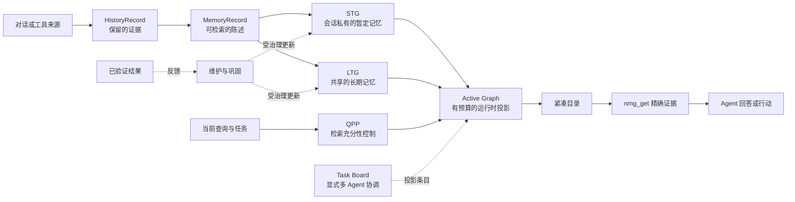

# NMG 概念地图

[English](concept-map.md)

本页只用于学习和导航，不是第二份规范。它为主要概念提供一句可操作的含义，并链接到拥有完整契约的文档。若本页与 owner 文档冲突，以 owner 为准。

## 一张图理解系统



最短的理解方式是：NMG 保留证据，把陈述组织进 STG 和 LTG，并只向模型暴露当前查询所需的 Active Graph。`search` 返回紧凑目录，`get` 打开选中的精确证据。

## 核心概念

| 概念 | 可操作含义 | 为什么存在 | 契约 owner |
| --- | --- | --- | --- |
| `HistoryRecord` | 被保留的来源证据与 provenance | 语义摘要必须可以核验 | [design.md §4](../design/design.md#4-core-data-model) |
| `MemoryRecord` | 从证据提取的一条可检索、有作用域的陈述 | 检索单位应小于整段会话 | [design.md §4](../design/design.md#4-core-data-model) |
| `MemoryNode` | 聚合相关记录的稳定语义地址 | 在不破坏记录 ID 的前提下局部组织记忆 | [design.md §4](../design/design.md#4-core-data-model) |
| STG | 保存暂定含义和当前任务信息的会话私有图 | 新信息应先可用，再决定是否相信其长期结构 | [memory-graphs.md §3](../design/memory-graphs.md#3-short-term-graph-stg) |
| LTG | 保存长期记忆和已巩固结构的共享持久图 | 长期 Agent 需要跨会话复用状态 | [memory-graphs.md §4](../design/memory-graphs.md#4-long-term-graph-ltg) |
| Active Graph（AG） | 从 STG、LTG 和临时任务关系选择出的有界查询时投影 | 模型只应看到有用工作集，而不是整个数据库 | [memory-graphs.md §5](../design/memory-graphs.md#5-active-graph-ag) |
| `activeGraphId` | 一次检索投影的稳定 ID，由 `search` 传给 `get` | 精确披露需要受预算、会话所有权和检索归因约束 | [design.md §2.1](../design/design.md#21-cli-and-resident-service) |
| QPP | 可选的检索广度与充分性预测 | 渐进式回忆需要决定停止、扩展或折叠噪声 | [检索置信度控制器](../design/retrieval-confidence-controller.md) |
| Memory chain | 对现有 memory ID 的有界有序视图 | 时间顺序和显式依赖不应复制证据 | [design.md §7.6](../design/design.md#76-static-temporal-and-logical-memory-chains) |
| Task Board | 位于语义记忆之外、有归因、有过期时间的任务级协作区 | 私有 AG 不能直接完成跨 Agent 通讯 | [memory-graphs.md §2.1](../design/memory-graphs.md#21-task-board-outside-the-three-memory-graphs) |
| 维护与巩固 | 确定性索引维护，加上有证据门控的语义晋升或拓扑 proposal | 写入成本必须有界，重复检索不能制造“事实” | [design.md §10](../design/design.md#10-incremental-storage-and-index-maintenance) |
| 可学习控制器 | 在硬预算内可选地学习 allocate、fold 和 rerank 的数值策略 | 可利用自然结果改进控制，但无需让记忆图本身可微 | [design.md §12](../design/design.md#12-learnable-routing-and-minimal-differentiable-query-graphs) |
| Lab | 通过显式 lease 使用的 reasoning workspace、graph reasoner 等可选能力 | 实验机制可以被使用，但不能静默成为默认行为 | [design.md §12ter](../design/design.md#12ter-session-reasoning-workspace-and-compaction-checkpoint) |

STG、LTG、AG 不是三份同类数据库。STG 和 LTG 是物理语义存储层；AG 是针对一次任务、在硬预算下构建的模型侧虚拟工作集。

## 第一次回忆的算法

```text
saved = remember(statement, node, type, scope)
directory = search(query, scope)
selectedIds = agent_select(directory.candidate_headers)
evidence = get(selectedIds, activeGraphId=directory.activeGraphId)
answer_from(evidence)
```

比语法更重要的是这些不变量：

1. `remember` 接纳一条有作用域的语义陈述，而不是复制整场会话。
2. `search` 可以明确返回“没有有用候选”。
3. 搜索目录是有损路由提示，不是回答证据。
4. `get` 才是无损披露步骤；若 `search` 返回了 `activeGraphId`，应继续传入。
5. 被检索、被披露或与回答文字重叠都不等于有用；只有可归因的已验证结果才能监督巩固或学习。

可以直接运行[第一次回忆教程](first-recall.zh-CN.md)。

## 接下来读什么

- 想使用产品：先跑[第一次回忆教程](first-recall.zh-CN.md)，再查看 `nmg remember --help`、`nmg search --help` 和 `nmg get --help`。
- 想修改架构：从[规范设计](../design/design.md)开始，并沿上表 owner 链接阅读。
- 想确认当前实现证据：查看 [completion-audit.md](../design/completion-audit.md)。
- 想修改 Agent 工作流：使用对应仓库 Skill，不要把操作规则复制进本页。
